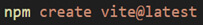
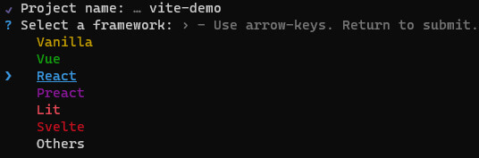
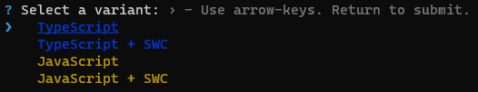
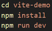
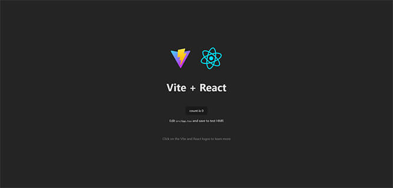
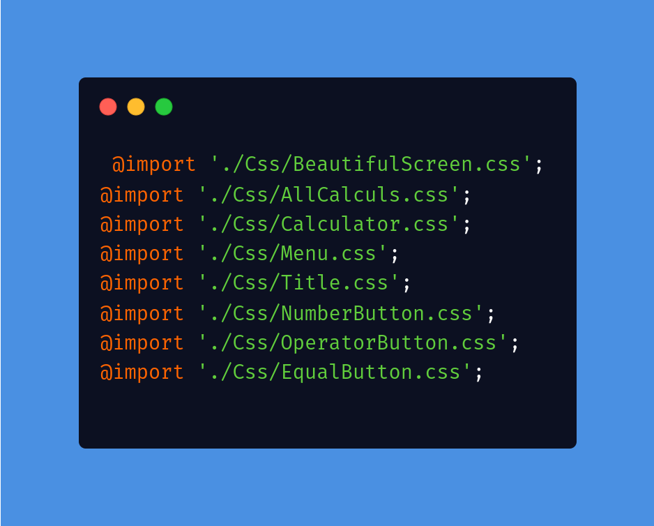
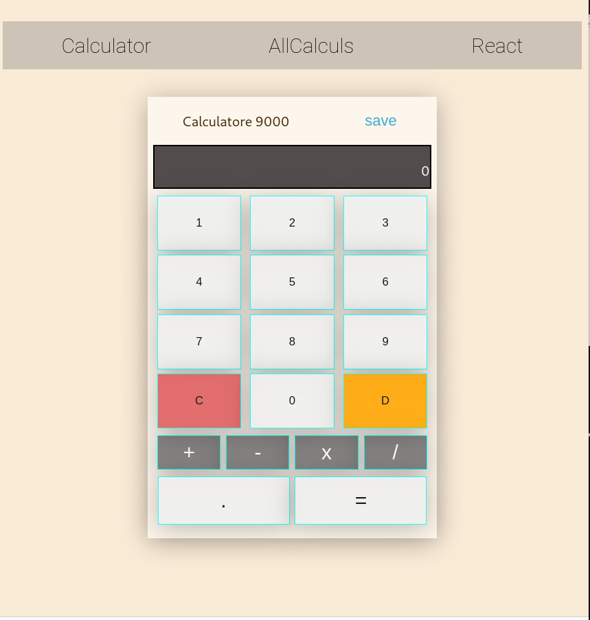

# Calculator 
Calculator est un projet d'apprentissage de La bibliothèque React-js pour les interfaces utilisateur web et natives

# Table des matières
- Installation
- Utilisation
- Contribuer
- Licence

# Installation
- MISE EN PLACE D’UN PROJET REACT AVEC VITE
  j'ai commencer à installer Node et Npm : Node v18.16.0. et VITE v4.3.9 

  Pour créer un projet React avec vite j'ai exécuter la commande suivante:

  

Ensuite j'ai choisie un nom pour mon projet avec project name....

  

Et enfin Javascript + SWC comme variant du projet

  

puis j'ai suivi les instructions pour finaliser l'intallation et le lancement du projet

  

Tadaaam ! L’application ReactJs sous Vite est maintenant créée :

  

# css
  

Ce fichier App.css permet de regrouper tous les autres fichiers css specific à chaque composant.

  

# Utilisation
Mon apllication calculator s'utilise comme un ecalculatrice simple elle permet de realiser des calcules d'additions de soustractions de divisions et de multiplication
 
 

# Auteurs

Maleye rane Ndoye

# Version
v.2.0

# Changelog

Creation de routes et de pages
Affichage des calculs sur une autre page 

# Références
https://react.dev/

